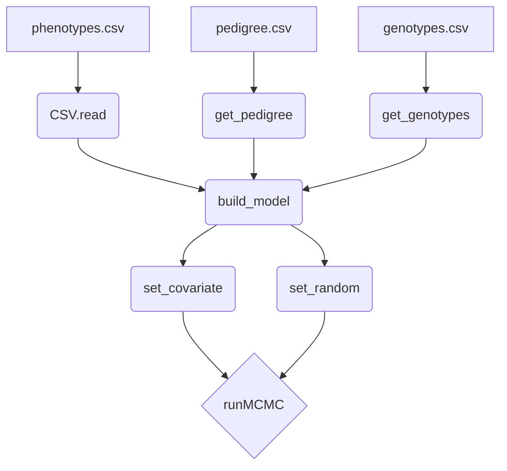

# JWAS.jl

<!------>

JWAS.jl is an open-source software tool written in Julia for Bayesian multiple regression methods applied to genomic prediction and genome-wide association studies.

* **Homepage**: [QTL.rocks](https://QTL.rocks)
* **Discussion group**: [available here](https://groups.io/g/qtlrocks)
* **Installation**: at the Julia REPL, `using Pkg; Pkg.add("JWAS")`
* **Documentation**: [available here](http://reworkhow.github.io/JWAS.jl/latest/)
* **Examples**: [available here](https://github.com/reworkhow/JWAS.jl/wiki)
* **Authors**: [Hao Cheng](http://qtl.rocks/chenglab.html), [Rohan Fernando](http://www.ans.iastate.edu/people/rohan-fernando), [Dorian Garrick](http://www.massey.ac.nz/massey/expertise/profile.cfm?stref=600130)

### Structure of JWAS

### Help

1. Show this README file in REPL or notebook using `?JWAS`
2. For help on a specific function above, type ? followed by its name, e.g. `?runMCMC` and press enter.
3. Run `Pkg.add(PackageSpec(name="JWAS", rev="master"))` to get the newest unofficial JWAS. Run `Pkg.free("JWAS")` to go back to the official one.

### Examples [available here](https://github.com/reworkhow/JWAS.jl/wiki)

* Single Trait Analysis
* Multiple Trait Analysis
* Repeated Measures
* Single Step Analysis
* Categorical Trait Analysis
* Censored Trait Analysis
* Joint Analysis of Continuous, Categorical, and Censored Traits
* Multi-class Bayesian Analysis
* Neural Networks (NN-MM)
* Cross Validation
* Genome Wide Association Study
* Integrating Phenotypic Causal Networks in GWAS
* single trait and multiple trait GBLUP by providing the relationship matrix directly
* Description of Mixed Effects Model
* Quality Control of Genotypes

